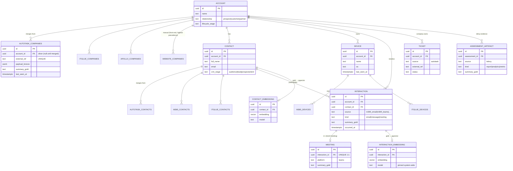

# Imperion CRM — Local Pipeline & Enrichment (on-prem)

**The on-prem, PowerShell, scheduled-task engine that does the heavy lifting.** It runs
unattended on Mark's home server, reads the full shared database locally, and takes the
bulk data-pipeline work **off the website and off Azure compute**: bulk source polling →
bronze, the bronze→silver→gold transforms, and **all embedding/vectorization** into
`pgvector`.

PowerShell 7 · Windows Scheduled Tasks · certificate-rooted unattended auth · writes the
one shared PostgreSQL + pgvector database.

> **Status:** _in development._ The installed `ImperionPipeline` module is built and tested
> (PowerShell 7, Pester). **Done:** the per-API **connect layer** (m365, azure, autotask, IT
> Glue, Telivy, Dark Web ID), the security-posture sync cmdlets, and the per-object **get
> layer** (collect → flatten to a bronze-shaped `[PSCustomObject]`, no writes) for all six
> sources — every public/private function has hermetic tests and the lint gate is green.
> **Next:** the **post layer** (per-`(source, entity)` bronze writers) and the
> **scheduled-task** files that compose get → post. See [`docs/STATUS.md`](docs/STATUS.md) for
> the detailed build progress. This is the **fourth repo** in the Imperion CRM system — read
> [`CLAUDE.md`](./CLAUDE.md) first.

> **Why this repo exists:** heavy pipeline processing was choking the website. The bulk of
> the pipeline now runs here, on a machine Mark controls, on its own schedule — leaving the
> live web app and the cloud functions for interactive, low-latency work.

> **The goal:** capture **all** the data the company knows — CRM (leads, accounts,
> contacts, proposals, contracts) **and** support (tickets, devices, the IT Glue / 365
> operational picture) — flow it to gold, and embed it, so the **front-end AI agents are
> aware of everything** once these pipelines are running. Built as **many small jobs** (one
> per source+entity), not a monolith.

---

## The four-repo system

| Repo | Role |
| --- | --- |
| **`ImperionCRM`** (front end) | **Live** web app (`imperioncrm.azurewebsites.net`, Entra SSO). **Owns the DB schema + migrations** (ADR-0017). Authoritative UI. Surfaces connection / GDAP health. |
| **`ImperionCRM_Backend`** (Functions) | *Interactive*: OAuth handshakes, real sends, the orchestrator agent + sub-agents, serving semantic search. Private, MI-auth, front-end-only (ADR-0028). |
| **`ImperionCRM_Pipeline`** (Functions) | *Cloud, internet-facing*: **inbound webhook receivers** (Autotask tickets, Graph change-notifications + renewal) and sub-minute event work. Keeps only what must run in Azure. |
| **`ImperionCRM_LocalPipelineEnrichment`** (this repo) | *On-prem, PowerShell, scheduled*: **bulk polling → bronze, bronze→silver→gold, and all vectorization**. The heavy-compute plane. |

**One system, four repos, one database.** This repo **reads and writes the shared tables
but never owns migrations** — propose schema changes in the front-end repo. **Do not
invent tables here.**

### Cloud vs. local — the boundary

```
flowchart LR
    subgraph CLOUD["ImperionCRM_Pipeline (Azure — keeps only this)"]
      W1["Autotask ticket webhooks"]
      W2["Graph change-notifications + renewal"]
    end
    subgraph LOCAL["This repo (home server — scheduled tasks)"]
      P["Bulk source polling → Bronze"]
      T["Bronze → Silver → Gold"]
      E["Vectorization → pgvector"]
    end
    W1 --> PG[("Shared PostgreSQL + pgvector")]
    W2 --> PG
    P --> PG
    T --> PG
    E --> PG
    PG --> A["Backend agent reads gold + vectors"]
```

**Rule:** anything that must receive inbound internet traffic stays in the cloud Pipeline
(a home server behind NAT can't reliably receive signed webhooks); everything scheduled or
compute-heavy runs here.

## Unattended auth — the certificate is the root of trust

One machine certificate anchors everything:

- **Opens the local secret store** — its private key decrypts the `SecretStore` vault
  password (CMS), so scheduled tasks `Unlock-SecretStore` with no human present.
- **Is the Entra app credential** — cert-based app-only auth to Microsoft Graph / Azure
  (no client secret needed).

The `SecretStore` then yields each **source API key** and the **embedding/LLM provider
keys**. It holds **no DB password** — Postgres access is a **short-lived Entra token**
minted by the cert app per run (`pgaadauth`, no stored secret). Tasks run under a dedicated
**gMSA / service account** (never an interactive user); the cert's private key is
**non-exportable** and ACL'd to that identity only. No secrets ever live in the repo or in
plaintext on disk. See [`CLAUDE.md §2`](./CLAUDE.md).

**Read-only by default.** The cert app has broad **`Reader`** across Azure and **read-only
GDAP** into 365 — **no write anywhere** except the three things the pipeline needs: **Azure
Storage**, the **shared PostgreSQL** (table-scoped role), and **Key Vault** (`Secrets
User`). Any new write capability is an explicit, human-approved grant.

## Client tenant access — GDAP, read-only

Same model as the cloud Pipeline: the cert-backed Entra app authenticates in the **partner
(CSP) tenant** and reads each **customer tenant's Microsoft Graph through the delegated
GDAP relationship** — least-privileged, time-bound, per-customer. Minimal GDAP roles,
per-tenant isolation, **fail closed on expiry**. Granting/widening/renewing roles is a
**human-approval gate**.

## Data sources — the bronze catalog

**Bronze grabs every attribute the API exposes (lossless), but presents a filter so silver
can refine later.** Every bronze row carries tenant, source, external id, content hash,
`collected_at`, and the raw payload.

| Entity | Bronze sources |
| --- | --- |
| **Companies** | `autotask_bronze` · `itglue_bronze` · `apollo_bronze` · `website_bronze` |
| **Users / Contacts** | `m365_contact_bronze` · `itglue_contact_bronze` · `autotask_contact_bronze` · `apollo_contact_bronze` · `website_contact_bronze` |
| **Devices** | `m365_devices_bronze` · `itglue_devices_bronze` · `website_devices_bronze` |
| **Proposals** | `kqm_proposal_bronze` · `website_proposal_bronze` |
| **Contracts** | `autotask_contract_bronze` · `docusign_contract_bronze` |
| **Tickets** | `autotask_ticket_bronze` |

`website_*` is a first-class source and carries the **highest merge precedence** (manual
web-app entries win). `m365` (not `365`) per the digit-prefix convention. Physical table
names are **defined by the front-end migration** — several sources here are new to the
schema and need migrations there first. See [`CLAUDE.md §5`](./CLAUDE.md).

## Data model — what this pipeline populates

The shared schema is **owned by the front-end repo** ([`ImperionCRM/docs/database/data-model.md`](../ImperionCRM/docs/database/data-model.md),
ADR-0017). This repo never owns migrations; it is a **producer** of the bronze rows, the
silver/gold aggregates, and the vectors below. The two diagrams show only the slice this
pipeline writes.

### Stages — the medallion flow

```mermaid
flowchart LR
    subgraph SRC["Sources (this repo polls)"]
      direction TB
      S1["m365 / azure (Graph + ARM, GDAP)"]
      S2["autotask · it glue · kaseya (KQM)"]
      S3["telivy · dark web id"]
    end
    SRC -->|"connect → get (flatten to flat table)"| BR
    subgraph BR["BRONZE — per-source, lossless + filter"]
      direction TB
      B1["*_companies · *_contacts · *_devices"]
      B2["autotask_ticket_bronze · *_contract_bronze · kqm_proposal_bronze"]
      B3["assessment_artifact (source=televy) · posture tables"]
    end
    BR -->|"precedence merge (website &gt; machine sources)"| SI
    subgraph SI["SILVER — unified entities"]
      direction TB
      V1["account · contact · device"]
      V2["interaction · meeting · ticket"]
    end
    SI -->|"summarize → knowledge objects"| GO["GOLD — summaries (summary_gold)"]
    GO -->|"chunk · embed (no re-embed on unchanged hash)"| VEC[("pgvector — interaction_embedding · contact_embedding")]
    VEC --> AG["Backend agent reads gold + vectors"]
```



### Tables — bronze → silver → gold (the producer's view)



> All `*_companies` bronze tables share the shape above (with `account_id`); `*_contacts`
> with `contact_id`; `*_devices` with `device_id` (front-end Diagram 6b). The **security
> posture** tables (`secure_scores`, `*_policies` + `*_golden`, `m365_service_principals`,
> the Azure inventory set) are written alongside this slice — see
> [`docs/database/`](docs/database) and the front-end ERD for their columns.

## The ingestion pattern — flatten → IT Glue → Postgres

How almost everything from Azure / 365 is collected, one shape end to end:

```
Source JSON → FLATTEN to [PSCustomObject] rows (only the attributes we care about)
            ├─► DOCUMENT in IT Glue + RELATE to other IT Glue objects (configs ↔ contacts ↔ orgs ↔ devices)
            └─► IMPORT the same flat table into Postgres bronze (no reshaping)
                 → Silver → Gold → embeddings
```

**IT Glue is a documentation + relationship hub, not just a source:** the flattened table
is written into IT Glue (keeping operational docs current and related) *and* imports
straight into Postgres from the identical shape. Operational/infrastructure data takes the
IT Glue path; pure CRM data (Apollo, KQM, DocuSign) flattens straight to Postgres. IT Glue
writes stay **scoped and gated** (system posture). See [`CLAUDE.md §6`](./CLAUDE.md).

## Vectorization — local orchestration, pinned (pluggable) embeddings

All embedding work runs here. Reading the corpus, chunking, dedup-by-hash, batching,
retry, cost accounting, and the `pgvector` upsert happen **locally**; only the embedding
inference call goes to the **provider-agnostic router** (Azure OpenAI / OpenAI / Claude),
with a **local model (Ollama/ONNX)** swappable behind the same interface later. One model
+ dimension is **pinned system-wide** so the vector space matches the backend agent;
unchanged content hash → no re-embed (no re-billing). See [`CLAUDE.md §7`](./CLAUDE.md).

## Security posture — inventory, Secure Score, golden states & drift

Beyond CRM/support data, the module ingests the Microsoft security estate (read-only):

- **`Invoke-ImperionServicePrincipalSync`** — Entra service principals → IT Glue + Postgres.
- **`Invoke-ImperionAzureInventorySync`** — management groups, subscriptions, resource
  groups, resources, and **Sentinel** (analytic/automation rules, workbooks, watchlists).
- **`Invoke-ImperionSecureScoreSync`** — Microsoft **Secure Score** snapshots + control attributes.
- **`Invoke-ImperionPolicySync`** — Conditional Access, Intune security, device
  configuration, Autopilot, and **Defender XDR** policies, with **drift vs. golden state**.

Each posture policy keeps an approved **golden state**; `Get-ImperionPolicyDrift` flags
**compliant / drift / ungoverned / missing**, and `Set-ImperionPolicyGoldenState` promotes a
current policy to baseline (human-gated). See [`docs/database/golden-states-and-drift.md`](docs/database/golden-states-and-drift.md).

## Tech stack

- **Installed PowerShell 7+ module** (`ImperionPipeline`) — every operation is an exported
  cmdlet; install with `build/Install-ImperionModule.ps1`. **Human-readable** — descriptive
  names, **`[PSCustomObject]` flat-table output** (the universal shape that documents to IT
  Glue and imports to Postgres unchanged).
- **`Microsoft.PowerShell.SecretManagement` + `SecretStore`** (secrets), **`MSAL.PS`**
  (cert-based Entra tokens), **`Npgsql`** (Postgres over TLS).
- **`PSScriptAnalyzer`** (lint) + **`Pester`** (tests) gate every merge.
- **Structured JSON logging** with run id, source, tenant, counts, duration, and embedding
  token/cost.

## Install & develop

```powershell
# runtime deps, machine-wide (elevated pwsh 7) — pinned SecretManagement/SecretStore/MSAL.PS + Npgsql
.\build\Install-ImperionDependencies.ps1
# dev/test tooling (current user is fine)
Install-Module Pester, PSScriptAnalyzer -Scope CurrentUser

# install the module + seed config in %ProgramData%\Imperion\
.\build\Install-ImperionModule.ps1 -Scope AllUsers

Import-Module ImperionPipeline
Get-Command -Module ImperionPipeline          # discover cmdlets
Initialize-ImperionContext                    # load config + unlock SecretStore
Invoke-Pester ./tests                         # unit tests (Pester 5)
```

Config lives in `%ProgramData%\Imperion\` (outside the module). **Never commit secrets,
`*.pfx`/`*.cer`, or exported credentials** — they belong in the SecretStore.

## Operations

- Scheduled tasks (registered by **`Register-ImperionTask`**) run under a dedicated **gMSA /
  service account**, "run whether logged on or not", each invoking one cmdlet after
  `Initialize-ImperionContext`. Task registry, **cert-rotation**, **Azure PG firewall /
  home-IP**, and **secret-rotation** runbooks live in `docs/operations/`.
- **Migrations are not run from here** — they live in the front-end repo (ADR-0017). Cmdlets
  fail loudly on a missing table rather than creating it.

## Releases & versioning

Releases follow the cross-repo standard in the front-end repo's
`docs/architecture/versioning-standard.md` (frontend ADR-0056): `MAJOR.FEATURE.MINOR`
strict 3-digit semver, majors are coordinated human-declared product milestones, and
release-please (manifest mode, release-type `simple` — version.txt + CHANGELOG.md)
maintains the Release PR — never hand-edit tags or the CHANGELOG, never
`gh release create` manually.

## Documentation & decisions

- **Read [`CLAUDE.md`](./CLAUDE.md) first.** ADRs live in `docs/decision-records/`. First
  ADRs: cloud/local boundary; certificate-rooted unattended execution (+ Owner-grant
  narrowing); local PG credential vs. Entra-token auth; vectorization strategy; source
  catalog + table-naming reconciliation.
- Cross-link the front-end `docs/database/data-model.md` (shared ERD), ADR-0017 (schema
  ownership), pipeline ADR-0009 / front-end ADR-0039 (per-source bronze + `website`
  precedence), and pipeline `CLAUDE.md §2` (GDAP). ADR numbers are **per-repo** — qualify
  cross-repo references by repo name.
- Documentation is a required deliverable and a security control: **code without docs is
  incomplete** (system-wide `CLAUDE.md §8`).

---

**Starting a new chat?** Open this repo, confirm `CLAUDE.md` is in place, and point the
session at `CLAUDE.md §10` (build order), the certificate trust chain (§2), the GDAP model
(§3), and the vectorization strategy (§7).
