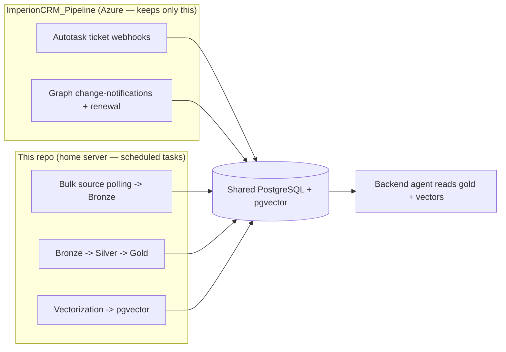

# Imperion CRM — Local Pipeline & Enrichment (on-prem)

**The on-prem, PowerShell, scheduled-task engine that does the heavy lifting.** It runs
unattended on Mark's home server, reads the full shared database locally, and takes the
bulk data-pipeline work **off the website and off Azure compute**: bulk source polling →
bronze, the bronze→silver→gold transforms, and **all embedding/vectorization** into
`pgvector`.

PowerShell 7 · Windows Scheduled Tasks · certificate-rooted unattended auth · writes the
one shared PostgreSQL + pgvector database.

> **Status (2026-06-16):** the installed `ImperionPipeline` module is **mature and shipping**
> (release **0.10.0**) — **198 exported cmdlets**, ~199 hermetic Pester test files, lint-clean
> `src/`. The full **connect → get → post → scheduled-task** spine is built across ~25 source
> areas, and the **gold knowledge + vectorization stage is LIVE in prod**: ~205
> `knowledge_object` rows are composed and embedded with Voyage `voyage-3-large` @ 1024 by the
> nightly `Imperion-KnowledgeVectorize` task. What remains is mostly **operator/credential
> gating** — many newer collectors are built and tested but DORMANT until their API key /
> consent / front-end bronze migration lands (see [`docs/STATUS.md`](docs/STATUS.md)). This is
> the **fourth repo** in the Imperion CRM system — read [`CLAUDE.md`](./CLAUDE.md) first.

> **Why this repo exists:** heavy pipeline processing was choking the website. The bulk of
> the pipeline now runs here, on a machine Mark controls, on its own schedule — leaving the
> live web app and the cloud functions for interactive, low-latency work.

> **The goal:** capture **all** the data the company knows — CRM (leads, accounts,
> contacts, proposals, contracts), support (tickets, devices, the IT Glue / 365 operational
> picture), **security posture** (Secure Score, policy drift, incidents, Purview),
> **finance** (QuickBooks Online), and **logistics** (Amazon Business / CDW procurement) —
> flow it to gold, and embed it, so the **front-end AI agents are aware of everything** once
> these pipelines are running. Built as **many small jobs** (one per source+entity), not a
> monolith.

---

## What this IS

- An **on-prem PowerShell module** (`ImperionPipeline`) run as **Windows Scheduled Tasks**,
  one task per `(source, entity)`.
- A **producer** of bronze / silver-feeding / gold rows and **vectors** into the shared
  PostgreSQL + pgvector database.
- The system's **bulk-compute and vectorization plane** — the heavy, bursty, retry-heavy
  work that does not belong on Azure interactive compute.
- **Outbound-only.** It makes API calls out; it exposes no inbound network surface.

## What this is NOT

- **Not the schema owner.** It reads/writes the shared tables but **never owns migrations** —
  schema changes are proposed in the front-end `ImperionCRM` repo (front-end ADR-0017). It
  **fails loudly** on a missing table; it never creates one.
- **Not a webhook receiver.** Inbound webhooks (Autotask tickets, Graph change-notifications)
  stay in the cloud `ImperionCRM_Pipeline` — a home server behind NAT can't receive signed
  inbound traffic reliably (ADR-0001).
- **Not a UI and not an agent.** It serves no pages; the orchestrator agent lives in
  `ImperionCRM_Backend`. This repo only fills the agent's retrieval surface.
- **Not a real-time engine.** It runs on a cadence; sub-minute reactions belong in the cloud.

---

## The four-repo system

| Repo | Role |
| --- | --- |
| **`ImperionCRM`** (front end) | **Live** web app (`imperioncrm.azurewebsites.net`, Entra SSO). **Owns the DB schema + migrations** (front-end ADR-0017). Authoritative UI. Surfaces client connection / onboarding-app access health. Master cross-repo doc: [`docs/architecture/system-of-systems.md`](../ImperionCRM/docs/architecture/system-of-systems.md). |
| **`ImperionCRM_Backend`** (Functions) | *Every process*: OAuth handshakes, real sends, the orchestrator agent + sub-agents, semantic search over the gold store. AI stack settled here — Claude (generation) + Voyage (embeddings), backend ADR-0034. Identity-gated (Easy Auth + caller allowlist, backend ADR-0035). |
| **`ImperionCRM_Pipeline`** (Functions) | *Cloud, internet-facing*: **inbound webhook receivers** (Autotask tickets, Graph change-notifications + renewal), the bronze→silver merge transform, and a caller-auth-gated `POST /api/refresh`. Bulk-poll timers RETIRED — this repo owns scheduled bulk ingestion. No AI code. |
| **`ImperionCRM_LocalPipelineEnrichment`** (this repo) | *On-prem, PowerShell, scheduled*: **bulk polling → bronze, bronze→silver→gold, and all vectorization**. The heavy-compute plane. |

**One system, four repos, one database.** This repo **reads and writes the shared tables
but never owns migrations** — propose schema changes in the front-end repo. **Do not invent
tables here.** The front end is also the master documentation hub; its
[`system-of-systems.md`](../ImperionCRM/docs/architecture/system-of-systems.md) is the
authoritative cross-repo map.

### Cloud vs. local — the boundary (ADR-0001)



**Rule:** anything that must receive inbound internet traffic stays in the cloud Pipeline
(a home server behind NAT can't reliably receive signed webhooks); everything scheduled or
compute-heavy runs here.

---

## Architecture at a glance — scheduled-task topology

The pipeline is **many small scheduled tasks** (one per `(source, entity)`), each invoking a
single module cmdlet after `Initialize-ImperionContext`. They run under a dedicated
**gMSA / service identity**, "run whether logged on or not", coordinated only by the shared
database (no task calls another). The nightly knowledge+vectorize task runs last, after the
ingest tasks have refreshed silver/gold inputs.

```mermaid
flowchart TB
    subgraph TRUST["Root of trust (one machine certificate)"]
      CERT["Cert in LocalMachine\\My (non-exportable, ACL'd to task identity)"]
      SS["SecretStore (source API keys + Voyage key)"]
      TOK["Entra app-only token (Graph / ARM / Key Vault / Postgres)"]
      CERT -->|CMS unlock| SS
      CERT -->|client credential| TOK
    end

    subgraph INGEST["Ingest tasks (one per source,entity) — cadence per docs/integrations"]
      direction LR
      M365["m365 / azure (Graph + ARM, per-client onboarding app)"]
      OPS["autotask · itglue · datto rmm/bcdr · myitprocess · unifi"]
      CRM["kqm · docusign · apollo · meta · plaud"]
      SEC["posture · security incidents · purview · darkwebid · telivy"]
      FIN["qbo finance · amazon business · cdw logistics · mileiq"]
    end

    TRUST --> INGEST
    INGEST -->|flatten -> IT Glue (ops only) -> bronze upsert| PG[("Shared PostgreSQL + pgvector")]

    subgraph GOLD["Nightly 04:30 — Imperion-KnowledgeVectorize"]
      KS["Invoke-ImperionKnowledgeSync -Vectorize"]
    end
    PG --> KS
    KS -->|compose -> chunk -> Voyage @1024 -> upsert| PG
    PG --> AGENT["Backend orchestrator (reads gold + vectors)"]
```

Topology details, cadences, and gating live in
[`docs/operations/scheduled-task-registry.md`](docs/operations/scheduled-task-registry.md)
and the per-source [`docs/integrations/`](docs/integrations/) docs. The full source roster is
catalogued in [`docs/collector-inventory.md`](docs/collector-inventory.md).

---

## Unattended auth — the certificate is the root of trust

One machine certificate anchors everything:

- **Opens the local secret store** — its private key decrypts the `SecretStore` vault
  password (CMS), so scheduled tasks `Unlock-SecretStore` with no human present.
- **Is the Entra app credential** — cert-based app-only auth to Microsoft Graph / Azure
  (no client secret needed).

The `SecretStore` then yields each **source API key** and the **Voyage embedding key**. It
holds **no DB password** — Postgres access is a **short-lived Entra token** minted by the cert
app per run (`pgaadauth`, no stored secret). Tasks run under a dedicated **gMSA / service
account** (never an interactive user); the cert's private key is **non-exportable** and ACL'd
to that identity only. No secrets ever live in the repo or in plaintext on disk. See
[`CLAUDE.md §2`](./CLAUDE.md) and [`docs/security/certificate-trust-chain.md`](docs/security/certificate-trust-chain.md).

**Read-only by default.** The cert app has broad **`Reader`** across Azure and **read-only**
into 365 — **no write anywhere** except the three things the pipeline needs: **Azure
Storage**, the **shared PostgreSQL** (table-scoped role), and **Key Vault** (`Secrets User`).
Any new write capability is an explicit, human-approved grant
([`docs/security/least-privilege-grants.md`](docs/security/least-privilege-grants.md)).

## Client tenant access — the per-client onboarding app (ADR-0018)

Client M365 data is reached via the **per-client, admin-consented onboarding app — the only
access model**. GDAP (partner-tenant delegated admin) is **scrapped** (pipeline ADR-0018);
Partner Center provisioning will not happen for v1. The cert-backed Entra app authenticates
**as the consented onboarding app in each client tenant** (client-credentials token in that
tenant) and reads that tenant's Graph read-only. Access is **per-tenant credentials, fail
closed** — an un-consented tenant is never touched, and per-tenant isolation is absolute
(every row tagged with its owning tenant). The legacy GDAP sweep is **dormant code**.
Onboarding / widening / renewing a tenant's access is a **human-approval gate**. See
[`CLAUDE.md §3`](./CLAUDE.md).

---

## Data sources — the bronze catalog

**Bronze grabs every attribute the API exposes (lossless), but presents a filter so silver
can refine later.** Every bronze row carries tenant, source, external id, content hash,
`collected_at`, and the raw payload. The original CRM/support catalog has since grown to span
the **security estate, finance, logistics, and scoped communications** — the full
source → cmdlet → bronze-target → cadence → ADR map is in
[`docs/collector-inventory.md`](docs/collector-inventory.md). At a glance:

| Domain | Sources |
| --- | --- |
| **CRM / sales** | Autotask · IT Glue · Apollo · KQM (Kaseya Quote Manager) · DocuSign · website · Meta (FB/IG) |
| **Support / operational** | Autotask tickets · IT Glue configs/export · m365 devices · Datto RMM · Datto BCDR · myITprocess · UniFi · Plaud |
| **Security posture** | Secure Score · Conditional Access / Intune / device-config / Autopilot / Defender policies (+ golden/drift) · Entra hygiene · security incidents · Purview compliance · Dark Web ID · Telivy · EasyDMARC · DNS |
| **Finance / BI** | QuickBooks Online (invoices, payments, customers, estimates, bills, chart of accounts, P&L, purchases) · MileIQ |
| **Logistics / procurement** | Amazon Business orders · CDW orders |
| **Scoped interaction** | allowlisted-principal ↔ client mail / Teams (ADR-0022) · cross-org m365 mail/Teams |

`website_*` is a first-class source with the **highest merge precedence** (manual web-app
entries win). `m365` (not `365`) per the digit-prefix convention. Physical table names are
**defined by the front-end migration** — several sources are gated on a front-end bronze
migration landing first. See [`CLAUDE.md §5`](./CLAUDE.md).

---

## The medallion flow — bronze → silver → gold → vectors

The shared schema is **owned by the front-end repo**
([`ImperionCRM/docs/database/data-model.md`](../ImperionCRM/docs/database/data-model.md),
front-end ADR-0017). This repo is a **producer** of the bronze rows, the silver/gold
aggregates, and the vectors. The diagram shows only the slice this pipeline writes.

```mermaid
flowchart LR
    subgraph SRC["Sources (this repo polls)"]
      direction TB
      S1["m365 / azure (Graph + ARM, onboarding app)"]
      S2["autotask · it glue · kqm · datto · qbo · amazon/cdw"]
      S3["telivy · dark web id · meta · plaud · scoped interaction"]
    end
    SRC -->|"connect -> get (flatten to flat table)"| BR
    subgraph BR["BRONZE — per-source, lossless + filter"]
      direction TB
      B1["{source}_{entity} (companies / contacts / devices / ...)"]
      B2["security-posture + incident + finance + logistics bronze"]
      B3["conversation_segment (ACS / Teams / Plaud uploads)"]
    end
    BR -->|"precedence merge (website > machine sources)"| SI
    subgraph SI["SILVER — unified entities (front-end / cloud owned)"]
      direction TB
      V1["account · contact · device · proposal · contract · ticket"]
      V2["interaction · conversation_segment · credential_exposure · posture"]
    end
    SI -->|"compose knowledge objects"| GO["GOLD — knowledge_object (one per entity)"]
    GO -->|"chunk v1 -> Voyage voyage-3-large @ 1024 (no re-embed on unchanged hash)"| VEC[("knowledge_embedding (pgvector 1024)")]
    VEC --> AG["Backend agent reads gold + vectors"]
```



> **Silver merge is front-end / cloud-Pipeline owned.** The on-prem collectors only write
> bronze; the precedence merge into silver (and the OKF semantic-layer meaning) lives in the
> front-end repo. See [`docs/database/medallion-and-write-path.md`](docs/database/medallion-and-write-path.md).

### The ingestion pattern — flatten → IT Glue → Postgres

How almost everything from Azure / 365 is collected, one shape end to end:

```
Source JSON -> FLATTEN to [PSCustomObject] rows (only the attributes we care about)
            |-> DOCUMENT in IT Glue + RELATE to other IT Glue objects (configs <-> contacts <-> orgs <-> devices)
            \-> IMPORT the same flat table into Postgres bronze (no reshaping)
                 -> Silver -> Gold -> embeddings
```

**IT Glue is a documentation + relationship hub, not just a source:** the flattened table is
written into IT Glue (keeping operational docs current and related) *and* imports straight
into Postgres from the identical shape. Operational/infrastructure data takes the IT Glue
path; pure CRM/finance/logistics data flattens **straight to Postgres**. IT Glue writes stay
**scoped and gated** (system posture). See [`docs/it-glue-hub.md`](docs/it-glue-hub.md) and
[`CLAUDE.md §6`](./CLAUDE.md).

## Vectorization — local orchestration, Voyage pinned (LIVE, ADR-0009)

All embedding work runs here. Composing the gold corpus, chunking (v1 = 6000 chars / 500
overlap), dedup-by-hash, batching, retry, cost accounting, and the `pgvector` upsert happen
**locally** (`Invoke-ImperionKnowledgeSync -Vectorize`). Only the embedding inference call
goes to **Voyage AI `voyage-3-large` at dimension 1024**, called **directly** (no provider
router — the system retired provider-agnosticism; front-end ADR-0041 / backend ADR-0034). The
constants live in one place (`Get-ImperionVectorContract`) and `Get-ImperionVoyageEmbedding`
**refuses any non-1024 vector** so vector spaces can never silently mix. One model + dimension
is **pinned system-wide** so the space matches the backend agent (which embeds only queries);
unchanged content hash → no re-embed, no re-bill. **This stage is live in prod** — ~205
`knowledge_object` rows are composed and embedded nightly. See
[`docs/vectorization-to-gold.md`](docs/vectorization-to-gold.md) and
[`docs/database/vector-lifecycle.md`](docs/database/vector-lifecycle.md).

## Security posture — inventory, Secure Score, golden states & drift

Beyond CRM/support/finance, the module ingests the Microsoft security estate (read-only):
service principals, Azure + Sentinel inventory, Secure Score snapshots, and security-posture
policies (Conditional Access, Intune, device configuration, Autopilot, Defender XDR), plus
security incidents and Purview compliance. Each posture policy keeps an approved **golden
state**; `Get-ImperionPolicyDrift` flags **compliant / drift / ungoverned / missing**, and
`Set-ImperionPolicyGoldenState` promotes a current policy to baseline (human-gated). See
[`docs/security-posture-bronze.md`](docs/security-posture-bronze.md) and
[`docs/database/golden-states-and-drift.md`](docs/database/golden-states-and-drift.md).

---

## Tech stack

- **Installed PowerShell 7+ module** (`ImperionPipeline`, ADR-0007) — every operation is an
  exported cmdlet; install with `build/Install-ImperionModule.ps1`. **Human-readable** —
  descriptive names, **`[PSCustomObject]` flat-table output** (the universal shape that
  documents to IT Glue and imports to Postgres unchanged).
- **`Microsoft.PowerShell.SecretManagement` + `SecretStore`** (secrets), **`MSAL.PS`**
  (cert-based Entra tokens), **`Npgsql`** (Postgres over TLS).
- **`PSScriptAnalyzer`** (lint, `src/` + `build/`) + **`Pester`** (tests) gate every merge.
- **Structured JSON logging** with run id, source, tenant, counts, duration, and embedding
  token/cost.

## Prerequisites & setup

```powershell
# 1. runtime deps, machine-wide (elevated pwsh 7):
#    pinned SecretManagement / SecretStore / MSAL.PS + Npgsql
.\build\Install-ImperionDependencies.ps1

# 2. dev/test tooling (current user is fine)
Install-Module Pester, PSScriptAnalyzer -Scope CurrentUser

# 3. install the module + seed config in %ProgramData%\Imperion\
.\build\Install-ImperionModule.ps1 -Scope AllUsers

Import-Module ImperionPipeline
Get-Command -Module ImperionPipeline          # discover the 198 cmdlets
Initialize-ImperionContext                    # load config + unlock SecretStore
Invoke-Pester ./tests                         # unit tests (Pester 5)
```

For an **unattended bring-up** (gMSA + cert + SecretStore + DB connectivity + onboarding-app
token), follow [`docs/deployment/unattended-bringup.md`](docs/deployment/unattended-bringup.md).
Config lives in `%ProgramData%\Imperion\` (outside the module). **Never commit secrets,
`*.pfx`/`*.cer`, or exported credentials** — they belong in the SecretStore.

## Operations

- Scheduled tasks (registered by **`Register-ImperionTask`**) run under the gMSA / service
  account, "run whether logged on or not", each invoking one cmdlet after
  `Initialize-ImperionContext`. The as-built registry, **cert-rotation**, **Azure PG firewall /
  home-IP**, and **secret-rotation** runbooks live in
  [`docs/operations/`](docs/operations/).
- **Migrations are not run from here** — they live in the front-end repo (front-end ADR-0017).
  Cmdlets fail loudly on a missing table rather than creating it.

## Releases & versioning

Releases follow the cross-repo standard in the front-end repo's
`docs/architecture/versioning-standard.md` (front-end ADR-0056): `MAJOR.FEATURE.MINOR` strict
3-digit semver, majors are coordinated human-declared product milestones, and release-please
(manifest mode) maintains the Release PR — never hand-edit tags or the CHANGELOG, never
`gh release create` manually. Current release: **0.10.0**.

## Documentation & decisions

- **Read [`CLAUDE.md`](./CLAUDE.md) first**, then the [`docs/`](docs/) tree
  ([`docs/README.md`](docs/README.md) is the map). ADRs live in
  [`docs/decision-records/`](docs/decision-records/) (ADR-0001 … ADR-0022). Consolidated
  onboarding guides: [collector inventory](docs/collector-inventory.md),
  [vectorization → gold](docs/vectorization-to-gold.md), [IT Glue hub](docs/it-glue-hub.md),
  [security-posture bronze](docs/security-posture-bronze.md).
- The system-wide security baseline is the front-end's `unified-security-standard.md` (mirrored
  read-only at [`docs/security/unified-security-standard.md`](docs/security/unified-security-standard.md)) —
  **referenced, never restated**.
- Cross-link the front-end `docs/database/data-model.md` (shared ERD), front-end ADR-0017
  (schema ownership), and the master cross-repo doc
  [`system-of-systems.md`](../ImperionCRM/docs/architecture/system-of-systems.md). ADR numbers
  are **per-repo** — qualify cross-repo references by repo name.
- Documentation is a required deliverable and a security control: **code without docs is
  incomplete** (system-wide `CLAUDE.md`).

---

**Starting a new chat?** Open this repo, confirm `CLAUDE.md` is in place, and point the
session at `CLAUDE.md §10` (build order), the certificate trust chain (§2), the per-client
onboarding-app model (§3), and the vectorization strategy (§7).
