# Deep dive — the MemPalace memory architecture, realized on Postgres + pgvector

> **Where this sits.** This is a rabbit-hole companion to the front-end canonical synthesis
> [`how-it-all-fits-together.md`](https://github.com/markdconnelly/ImperionCRM/blob/main/docs/architecture/deep-dives/how-it-all-fits-together.md)
> and the public papers
> ([executive summary](https://github.com/markdconnelly/ImperionCRM/blob/main/public/papers/executive-summary.html) ·
> [research paper](https://github.com/markdconnelly/ImperionCRM/blob/main/public/papers/research-paper.html)).
> It lives in **this** repo because **`ImperionCRM_LocalPipelineEnrichment` physically realizes the
> memory** — it is the system's *only* embedding producer and the only place gold summaries are
> composed (the "hippocampus", `CLAUDE.md §1`). The companion deep dive is
> [`open-brain-second-brain.md`](open-brain-second-brain.md) (the tiered/personal half).

## What we borrowed — and what we deliberately did NOT take as a dependency

[**MemPalace**](https://github.com/MemPalace/mempalace) ("The best-benchmarked open-source AI
memory system… Local-first AI memory. Verbatim storage, pluggable backend, 96.6% R@5 raw on
LongMemEval — zero API calls") is the reference design we benchmarked memory recall against. Its
load-bearing ideas, in MemPalace's own vocabulary:

- **The memory-palace spatial pattern** — memory is organized into **Wings** (entities: people,
  projects), **Rooms** (topics within an entity), and **Drawers** (the original verbatim
  content). Recall walks the palace.
- **Verbatim storage, never summarized in place** — "stores your conversation history as
  verbatim text and retrieves it with semantic search," without paraphrasing. The original
  wording *is* the answer.
- **A pluggable retrieval backend** — ChromaDB by default, but SQLite / Qdrant / **pgvector**
  are first-class alternatives, plus an optional hybrid ranker over the semantic core.

**Imperion borrows the pattern, not the package.** MemPalace is MIT and excellent, but adopting
it as a dependency would have meant a second store alongside the medallion database, a second
identity/RLS model on the most sensitive data we hold, and a second vector space to keep in sync
with the one the backend agent already queries. The system's whole thesis is *one governed
brain* (`data-design-for-agents.md`). So we re-implemented the **pattern** on the substrate we
already own — Postgres + pgvector — and mapped the palace vocabulary onto the medallion:

| MemPalace concept | Imperion realization | Owned / produced by |
|---|---|---|
| **Drawer** (verbatim original) | **bronze**: `memory_drawer` (non-transcript human notes/conversations, FE ADR-0113) · `agent_message` (agent-run transcripts, FE 0056/0163) | capture = backend / GUI |
| **Room / Wing** (topic / entity) | gold **`knowledge_object`** (`entity_type` + `entity_ref`), the `wing` convention (`user:<id>` / `project:<id>` / `agent:<slug>`) | **this repo** (compose) |
| **Semantic index** | **`knowledge_embedding`** — pgvector, Voyage `voyage-3-large` @ 1024, HNSW cosine | **this repo** (the sole embedder) |
| **Hybrid ranker** | the **gold hybrid ranker** (FE ADR-0115): semantic + keyword + metadata + temporal | front-end read / backend embed+rerank |

The rest of this doc explains the data-structure decisions behind that table — why a single
vector space, why two-level recall, why the ranker is shaped the way it is, and exactly which
parts this repo produces.

## The data-structure decisions

### 1. One vector space, pinned — not a per-store embedding

MemPalace lets you swap backends; the cost of that flexibility is that *meaning* is only
comparable inside one backend's embedding. Imperion makes the opposite trade on purpose: **one
model, one dimension, system-wide, pinned forever** unless a versioned re-embed says otherwise.

- **Voyage AI `voyage-3-large` at dimension 1024**, called **directly** — no provider router
  (the system retired provider-agnosticism). Anthropic's recommended embeddings provider for
  Claude RAG. (This repo's ADR-0009; front-end ADR-0041; backend ADR-0034.)
- The constants (model, dimension, chunking `v1` = 6000 chars / 500 overlap, batch size, cost
  rate) live in **one** place and are *consumed*, never re-declared: `Get-ImperionVectorContract`
  vendors the single canonical contract (ADR-0025 / #231). Two hand-maintained copies is exactly
  how a vector space silently splits.
- `Get-ImperionVoyageEmbedding` **refuses any response vector that is not exactly 1024.** A
  wrong-dimension vector can never enter the space.
- Every `knowledge_embedding` row stores `embedding_model`, `dimension`, and `chunking_version`.
  A model or chunking change is a **versioned re-embed** — the vectorizer only ever touches rows
  matching its own `(embedding_model, chunking_version)` pair; other versions coexist until
  verified, then are pruned. A *dimension* change needs a new `vector(N)` column — a front-end
  migration.

**Why this matters for recall:** the producer (this repo) and the consumer (the backend agent,
which embeds only *queries* against the same contract) write and read the **same** space.
There is no "MemPalace backend vs query backend" gap. The encoding of long-term memory is fixed,
so a query vector and a corpus vector are directly comparable — that is the whole point of a
single pinned contract.

### 2. Two-level recall — gold summary first, drill to verbatim bronze (FE ADR-0113)

MemPalace's thesis is *recall the verbatim original*. The naïve way to honor that is to embed
every raw turn and search the raw text. Imperion splits it deliberately, because the medallion
already tells us where verbatim belongs:

- **Verbatim is bronze.** A conversation turn is raw source data — bronze, by definition. It is
  **never summarized in place.** Agent-run transcripts live in the existing
  `agent_conversation → agent_run → agent_message` ledger (FE 0056/0163); non-transcript human
  verbatim (user notes, captured human conversations) lives in `memory_drawer` (FE ADR-0113 /
  migration 0167).
- **The summary is gold.** Each conversation's *summary* is a `knowledge_object`
  (`entity_type='conversation_segment'`/conversation, `entity_ref` = the source id), embedded
  and hybrid-searchable.
- **Recall is two-level:** search the **gold summary** (cheap, semantic, ranked), then **drill
  to the verbatim bronze** rows via `entity_ref` for faithful, quotable recall. This amends the
  old "agents consume Gold only" rule to *"reason/search over Gold; drill to bronze verbatim via
  references for faithful recall."*

Why not embed every raw turn directly? Three reasons: (a) cost — re-embedding every turn of
every conversation is the most expensive thing the system does, and most turns are never
recalled; (b) precision — a summary is a better *index* (it names the entities and decisions) and
the verbatim is a better *answer*, so you want the summary in the vector space and the verbatim
one cheap join away; (c) attribution — a retrieved summary that resolves to an exact source turn
is **citable**, not hallucinated (see the citation views below).

This is the data-structure reason the palace's **Drawer** (verbatim) and **Room** (topic) are
*different tables* in Imperion, joined by reference — not one embedded blob.

### 3. The gold hybrid ranker (FE ADR-0115) — semantic alone is not recall

A second brain's recall question — *"what did we decide about X,"* *"find the call where the
client said Y"* — wants more than nearest-neighbour cosine. MemPalace's hybrid-v4 (semantic →
keyword boost → temporal proximity → optional LLM rerank) and OB1's metadata-facet GIN filter
are the reference. Imperion's ranker is **four deterministic stages combined as a weighted sum**
over the gold store (`knowledge_object` / `knowledge_embedding`, hybrid substrate from FE
migration 0166):

1. **Semantic** — HNSW cosine over `knowledge_embedding.embedding`, **filtered to the pinned
   `(embedding_model, dimension, chunking_version)` triple** so spaces never mix. Weight **1.0**.
2. **Keyword** — `ts_rank` over the generated `chunk_fts` tsvector (GIN). Exact-term precision a
   vector misses. Weight **0.3**.
3. **Metadata containment** — `metadata @>` via the GIN index on `knowledge_object.metadata`.
   Facet filters (tenant, entity type, source). 
4. **Temporal recency decay** — a recency bias with a **30-day half-life**. Weight **0.2**.

The split of *where each stage runs* is the four-repo boundary made concrete (ADR-0042 §1):

- **The deterministic ranker is a front-end READ** — given a query *vector*, running the SQL is
  not an AI call, so it lives in the front end (`gold-knowledge-search.ts`), under `withIdentity`
  so **RLS applies to recall**.
- **Generating the query vector** (a Voyage call) and the **optional Claude Haiku rerank** are AI
  calls → **backend** (Backend #304 / #305). The front end holds no AI key.

Results are `knowledge_object` rows carrying `entity_ref`, so every caller can drill to the
verbatim store (§2). The ranker is the recall surface the **Universal Memory MCP** (FE ADR-0116,
`recall` tool) calls — see [`open-brain-second-brain.md`](open-brain-second-brain.md).

## This repo's role — the sole producer of the memory

Everything above is *read* by the backend and front end. **It is *written* here.** This repo
moved off the website precisely because embedding is the heaviest, burstiest, most cost-sensitive
stage (`CLAUDE.md §7`).

```mermaid
flowchart LR
    subgraph BRONZE["Bronze (verbatim — the Drawers)"]
      MD["memory_drawer (human notes / conversations)"]
      AM["agent_message (agent-run transcripts)"]
      SRC["~60 source collectors → *_bronze"]
    end
    BRONZE --> SILVER["Silver (facts: account/contact/device/ticket/...)"]
    SILVER --> COMPOSE["Get-ImperionKnowledge* over Invoke-ImperionKnowledgeCompose<br/>(this repo) — the Rooms/Wings"]
    COMPOSE --> KO[("knowledge_object<br/>Set-ImperionKnowledgeObject (content_hash gated)")]
    KO --> CHUNK["Split-ImperionTextChunk (v1: 6000/500)"]
    CHUNK -->|changed objects only| VOYAGE["Get-ImperionVoyageEmbedding<br/>voyage-3-large @ 1024 (refuses other dims)"]
    VOYAGE --> KE[("knowledge_embedding (pgvector 1024, HNSW)")]
    KE --> RANK["Gold hybrid ranker (FE ADR-0115)"]
    RANK --> AGENT["Backend orchestrator / Universal Memory MCP recall"]
    KE -.citation.-> CITE["conversation_segment_citation view"]
```

- **Compose (the Rooms/Wings).** `Get-ImperionKnowledge*` composers — each a thin adapter over
  the shared `Invoke-ImperionKnowledgeCompose` spine (#106) — emit one `knowledge_object` per
  entity (`account · contact · contract · ticket · device · exposure · assessment · proposal ·
  posture · social · conversation_segment`). A new entity is a SQL query + a `-Compose`
  scriptblock; the row shape and idempotency contract live in **one** place. **Gold summaries
  for the verbatim-memory recall path are LP #300.**
- **Embed (the semantic index).** Chunk (`Split-ImperionTextChunk`, v1) → embed
  (`Get-ImperionVoyageEmbedding`) → upsert `knowledge_embedding`
  (`Invoke-ImperionVectorizeKnowledge`). **Hydrating `knowledge_embedding` for the unified-memory
  recall path is LP #176** — until it runs, the gold hybrid ranker and the MCP `recall` tool are
  deploy-dormant (FE ADR-0116 names LP #176 + LP #300 as its activation deps).
- **Entry point + cadence.** `Invoke-ImperionKnowledgeSync [-Vectorize]`, run nightly **04:30**
  by the `Imperion-KnowledgeVectorize` scheduled task, after the night's ingest refreshes silver.
  This is the *sleep-time consolidation pass*: facts → knowledge → encoded recall.

> **Live shape (prod, 2026-06-25):** `knowledge_object` ≈ **1,547** composed rows;
> `knowledge_embedding` = **0** — vectorization has **not** been run in prod, so the recall path
> (gold hybrid ranker + the MCP `recall` tool) is **deploy-dormant** pending LP #176 (the embedder
> is built and the Voyage key is provisioned — Key Vault `Voyage-Embedding-API-Key`, SecretStore
> mirror `embedding-provider-key`). Counts are illustrative, not a contract — coverage is the goal,
> gaps are bugs.

### Idempotency & cost — re-consolidating unchanged memory is free

Two layers, so an unattended re-run converges and never re-bills:

1. **Object layer** — unchanged `knowledge_object.content_hash` → the row is not rewritten.
2. **Chunk layer** — unchanged **chunk-hash set** for the pinned `(embedding_model,
   chunking_version)` → **no re-embed, no re-billing**.

Every run emits a `Metric` log line: objects scanned/unchanged/embedded, chunks, billed tokens,
estimated USD (~$0.18/M tokens, input-only), provider/model/dimension/chunking version,
duration. Counts only — never row content (`CLAUDE.md §8`).

### Recall with attribution — the citation views

A second brain's recall must be *verifiable* — memory the agent can cite, not invent. A retrieved
`knowledge_embedding` whose object is `entity_type='conversation_segment'` resolves to its source
conversation + diarized turn through the **`conversation_segment_citation`** view (front-end
ADR-0068), so the backend renders an attributed citation (channel / account / speaker / offsets /
text). Purged conversations are excluded in both the composer query and the view. This is the
mechanism that makes the two-level recall of §2 *trustworthy*: the summary is the index, the
verbatim is the answer, and the citation is the proof.

### PII & safety boundaries (enforced in the composers)

`exposure` carries `credential_exposure` **facts only** — no raw breach payloads, no plaintext
credentials ever reach gold. `posture` is one object per tenant (Secure Score + drift counts +
named gaps), not per-policy detail. Per-tenant isolation is absolute — every row is stamped with
its owning tenant; no cross-tenant read in any query path. The personal tier's privacy contract
is Postgres RLS, covered in [`open-brain-second-brain.md`](open-brain-second-brain.md).

## See also

- [`open-brain-second-brain.md`](open-brain-second-brain.md) — the tiered/personal half (canon ·
  company · personal; the Personal Knowledge Store; the Universal Memory MCP).
- [`../../vectorization-to-gold.md`](../../vectorization-to-gold.md) — the onboarding narrative of
  the compose → embed pipeline.
- [`../../database/vector-lifecycle.md`](../../database/vector-lifecycle.md) — the as-built
  lifecycle, target schema, idempotency layers, citation-view DDL.
- Front-end ADRs: **0041** (vector contract) · **0113** (verbatim memory tier) · **0115** (gold
  hybrid ranker) · **0116** (Universal Memory MCP). This repo: **ADR-0009** (settled embedding
  stack) · **ADR-0025** (consume the vendored vector contract).
- The superiority argument:
  [`data-design-for-agents.md`](https://github.com/markdconnelly/ImperionCRM/blob/main/docs/architecture/data-design-for-agents.md).
