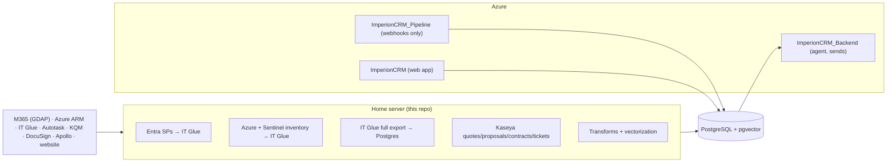

# Architecture — on-prem pipeline plane

The fourth repo in the Imperion CRM system: an **on-prem, PowerShell, scheduled-task**
ingestion/enrichment/vectorization engine. Outbound-only; no inbound surface. Writes the
shared PostgreSQL + pgvector DB the website reads and the backend agent queries.

## Context (cloud/local boundary — ADR-0001)

## Trust & data flow
- **Auth:** one machine cert → unlocks SecretStore + is the Entra app credential
  ([security/certificate-trust-chain.md](../security/certificate-trust-chain.md)).
- **Ingestion pattern:** flatten → (IT Glue document + relate) → Postgres bronze
  ([database/medallion-and-write-path.md](../database/medallion-and-write-path.md), ADR-0006).
- **DB:** short-lived Entra token, TLS, table-scoped role (ADR-0003).
- **Change detection:** content hash + watermark — "if nothing changed, move on"
  ([operations/change-detection.md](../operations/change-detection.md)).
- **Vectorization:** local orchestration, pinned pluggable provider (ADR-0004).

## Required diagrams (to add under [../diagrams/](../diagrams/))
high-level (above) · application (module map) · infrastructure (home node + Azure) · data
flow (medallion) · security (trust chain) · agent (N/A — cross-ref backend) · integration
(per-source) · deployment (task registration). Mermaid source committed.
