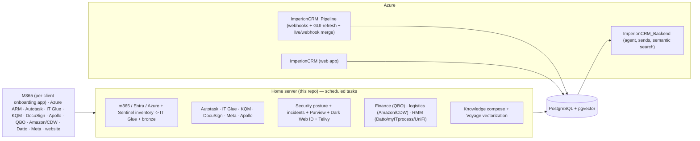

# Architecture — on-prem pipeline plane

The fourth repo in the Imperion CRM system: an **on-prem, PowerShell, scheduled-task**
ingestion/enrichment/vectorization engine. Outbound-only; no inbound surface. Writes the
shared PostgreSQL + pgvector DB the website reads and the backend agent queries. The master
cross-repo map is the front-end's
[`docs/architecture/system-of-systems.md`](../../../ImperionCRM/docs/architecture/system-of-systems.md).

## Context (cloud/local boundary — ADR-0001)

## Trust & data flow
- **Auth:** one machine cert → unlocks SecretStore + is the Entra app credential
  ([security/certificate-trust-chain.md](../security/certificate-trust-chain.md)).
- **Client M365 access:** the **per-client onboarding app** (ADR-0018), read-only, fail-closed
  per tenant — GDAP is scrapped (the legacy sweep is dormant code). See [../../CLAUDE.md §3](../../CLAUDE.md).
- **Ingestion pattern:** flatten → (IT Glue document + relate, ops only) → Postgres bronze
  ([database/medallion-and-write-path.md](../database/medallion-and-write-path.md), ADR-0006;
  [it-glue-hub.md](../it-glue-hub.md)).
- **Merge co-locates with ingestion (ADR-0026):** this repo owns the bronze→silver merge for the
  sources it bulk-ingests (posture, Meta, DNS, M365 directory #239, `cloud_asset` #241) — an
  idempotent `Invoke-Imperion*Merge` run after each source's collectors. The cloud Pipeline keeps
  only the live/webhook-driven merge.
- **DB:** short-lived Entra token, TLS, table-scoped role (ADR-0003).
- **Change detection:** content hash + watermark — "if nothing changed, move on"
  ([operations/change-detection.md](../operations/change-detection.md)).
- **Vectorization:** local orchestration, Voyage `voyage-3-large` @ 1024 called directly,
  pinned system-wide (ADR-0009 / front-end ADR-0041) — **LIVE in prod**
  ([vectorization-to-gold.md](../vectorization-to-gold.md)).

## Domains (the source roster, grouped)
The pipeline has grown well beyond the original CRM/support catalog. Each domain is a set of
per-`(source, entity)` collectors writing bronze; the full map is in
[`collector-inventory.md`](../collector-inventory.md).

| Domain | What | ADR |
| --- | --- | --- |
| **CRM / sales** | Autotask, IT Glue, Apollo, KQM, DocuSign, website, Meta (FB/IG) | ADR-0005, ADR-0013 |
| **Support / operational** | Autotask tickets, IT Glue export, m365 devices, Plaud | ADR-0005, ADR-0006 |
| **RMM / managed estate** | Datto RMM, Datto BCDR, myITprocess, UniFi | ADR-0018 |
| **Cloud / CMDB** | Azure ARM cloud-resource inventory → silver `cloud_asset` CI (estate fan-out from `account_tenant`, on-prem merge) | ADR-0023, ADR-0026 |
| **Security posture** | Secure Score, policy drift, Entra hygiene, info protection, incidents, Purview, Dark Web ID, Telivy, EasyDMARC, DNS | ADR-0008, ADR-0010, ADR-0011, ADR-0019 |
| **Finance / BI** | QuickBooks Online (full pull), MileIQ | ADR-0014, ADR-0017, ADR-0020 |
| **Logistics / procurement** | Amazon Business orders, CDW orders | ADR-0021 |
| **Scoped interaction** | allowlisted-principal ↔ client mail / Teams; cross-org comms | ADR-0022 |
| **Vectorization / gold** | knowledge compose + Voyage embeddings + conversation_segment citation | ADR-0004, ADR-0009, ADR-0016 |

## Required diagrams (under [../diagrams/](../diagrams/))
high-level (above) · application (module map) · infrastructure (home node + Azure) · data
flow (medallion, see [database/medallion-and-write-path.md](../database/medallion-and-write-path.md)) ·
security (trust chain) · agent (N/A — cross-ref backend) · integration (per-source, see the
[collector inventory](../collector-inventory.md)) · deployment (task registration). Mermaid
source is committed alongside the relevant doc.
