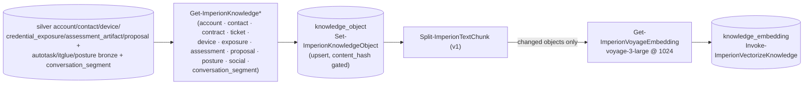

# Vector lifecycle

All embedding/vectorization runs on the home node (ADR-0004, **built by ADR-0009** —
module v0.3.0). The **target schema is front-end `db/migrations/0045` + ADR-0041**
(`ImperionCRM`) — this repo is its sole producer; the backend agent reads it (and embeds
only *queries*, backend ADR-0034).

> **The encoding of long-term memory.** This lifecycle is the **encoding step of memory
> consolidation** in Imperion OS's second-brain model: gold knowledge is chunked and embedded
> into a *fixed* vector space (Voyage `voyage-3-large` @ 1024, pinned by ADR-0009/0025) so the
> agents recall by meaning. One model + dimension, system-wide, is what keeps the producer's
> memory space identical to the recall side; content-hash idempotency means re-consolidating
> unchanged memory is free. See the front-end superiority doc
> [`data-design-for-agents.md`](https://github.com/markdconnelly/ImperionCRM/blob/main/docs/architecture/data-design-for-agents.md).

## The pipeline (as built)

Entry point: **`Invoke-ImperionKnowledgeSync [-Vectorize]`** — the
`Imperion-KnowledgeVectorize` scheduled task (daily 04:30, after the night's ingest
tasks land).

- **Target tables:** gold **`knowledge_object`** (one per entity: `tenant_id, entity_type,
  entity_ref, title, body, summary, source, content_hash, metadata`) → **`knowledge_embedding`**
  (chunked vectors: `chunk_index, chunk_text, embedding vector(1024), embedding_model, dimension,
  chunking_version, content_hash, token_count`, HNSW cosine index). The pipeline SP role has
  `SELECT/INSERT/UPDATE` on both + `DELETE` on `knowledge_embedding` (the per-object chunk
  replace + pruning superseded versions); the backend agent reads them.
- **What gets embedded:** the composed `body` of gold knowledge objects. **Coverage:
  accounts** (contact roster, opportunities, contracts, recent tickets), **contacts**
  (profile, reachability, CRM standing), **contracts** (terms, dates, value — per-entity
  granularity), **tickets** (full description + resolution — the support memory),
  **devices** (`entity_type='device'` — silver `device` + not-yet-merged IT Glue
  configurations, mirroring the front-end `device_inventory_all` view), **exposures**
  (`'exposure'` — `credential_exposure` facts only; no raw breach payloads, no plaintext
  credentials ever reach gold), **assessments** (`'assessment'` — `assessment_artifact`
  evidence with its assessment/account context), **proposals** (`'proposal'` — lifecycle,
  value, opportunity/account context), **posture** (`'posture'` — ONE object per
  tenant: latest Secure Score + per-type policy drift counts and named gaps via
  `Get-ImperionPolicyDrift`), and **social** (`'social'` — one per FB/IG silver
  `interaction` of kind social_post/social_comment/dm: author, text, engagement,
  permalink, and the resolved contact for DM-sender leads; #127), and **conversation
  segments** (`entity_type='conversation_segment'` — one per silver `conversation_segment`
  diarized turn from ACS calls / Teams meetings / uploads: speaker + turn text framed with
  the channel, account, and recording offsets; front-end ADR-0068, #200. The segment is
  the embedding unit pinned by ADR-0068; a retrieved vector traces back to its source
  conversation + turn through the **`conversation_segment_citation`** view — see below).
  Each further entity (IT Glue/Azure docs) is one new
  composer + one line in the sync — coverage is the goal, tracked in the
  production-readiness plan.
- **Citation view (conversation segments, ADR-0068):** a retrieved
  `knowledge_embedding` resolves to its source conversation + diarized turn through
  **`conversation_segment_citation`** (a front-end view — DDL source-of-record in this
  repo's [`sql/conversation_segment_citation_schema.sql`](../../sql/conversation_segment_citation_schema.sql),
  a pending front-end migration; see `front-end-schema-handoff.md`). It joins the gold
  object (`entity_type='conversation_segment'`, `entity_ref` = the segment id) to silver
  `conversation_segment` → `conversation`, exposing channel/account/speaker/offsets/text so
  the backend can render an attributed citation. Purged conversations are excluded both in
  the composer query and the view. The composer needs `SELECT` on `conversation` +
  `conversation_segment` for the `imperion-localpipeline` role (same migration request).
- **Composer spine (#106):** every `Get-ImperionKnowledge*` composer is a thin adapter
  over the module-internal **`Invoke-ImperionKnowledgeCompose`** — it owns the shared
  scaffold (tenant default, connection lifecycle, related-row lookup caches, the
  `knowledge_object` row emit + `content_hash` over title+body, the metric log). A new
  entity type is a SQL query + a `-Compose` scriptblock; the row shape and idempotency
  contract live in ONE place.
- **Pinned model (front-end ADR-0041 / backend ADR-0034):** **Voyage AI `voyage-3-large` at
  dimension 1024**, system-wide — Anthropic's recommended embeddings provider for Claude RAG.
  Stored as `embedding_model='voyage-3-large'`, `dimension=1024` on every row.
  `Get-ImperionVoyageEmbedding` **refuses** any response vector that is not exactly 1024.
- **Provider (ADR-0009):** Voyage is called **directly** (no router — the system retired
  provider-agnosticism). The constants live in ONE place (`Get-ImperionVectorContract`).
  A local on-prem model (Ollama/ONNX) remains a possible future ADR via a **versioned
  re-embed**; a *dimension* change needs a new `vector(N)` column (front-end migration).
- **Chunking v1 (pinned):** max **6000 chars** per chunk, **500 chars** overlap, splits
  prefer paragraph → sentence → word boundaries within the final fifth of the window
  (`Split-ImperionTextChunk` — deterministic).
- **Idempotency (two layers):** unchanged object `content_hash` → `knowledge_object` not
  rewritten; unchanged **chunk-hash set** for the pinned (model, chunking_version) → no
  re-embed, **no re-billing**. Re-runs converge.
- **Re-embed:** a model/chunking change is a **versioned re-embed**, never in-place — the
  vectorizer only ever replaces rows matching its own (embedding_model, chunking_version);
  other versions coexist until verified, then pruned (the SP's scoped `DELETE`).
- **API key (front-end ADR-0129 §8, supersedes ADR-0009's order):** the Voyage key is the
  PLATFORM-scope AI credential, read from **Key Vault `conn-platform-voyage`** by the cert SP
  (`Key Vault Secrets User`). There is no SecretStore mirror — the mis-named starter secret
  (`Voyage-Embedding-API-Key` / `embedding-provider-key`) is retired (folds #389). Key Vault,
  via the `connection` registry's platform scope, is the single source of truth — the same
  link the backend resolves for query embeddings.
- **Cost telemetry (every run):** objects scanned/unchanged/embedded, chunks, billed
  tokens, estimated USD (~$0.18/M tokens, input-only), provider, model, dimension,
  chunking version, duration — emitted as a `Metric` log line by
  `Invoke-ImperionVectorizeKnowledge`.
