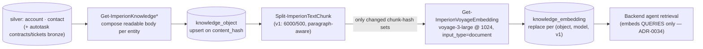

# ADR-0009 — The embedding stack is settled: Voyage direct, pinned, built

- **Status:** Accepted
- **Date:** 2026-06-09
- **Amends:** [ADR-0004](ADR-0004-vectorization-local-orchestration.md)
  (its "provider-agnostic router / pluggable provider" framing is retired; its
  local-orchestration + pinned-contract core is implemented as designed).
- **Relates to:** front-end ADR-0041 (the pinned vector contract / migration 0045),
  backend ADR-0034 (Claude + Voyage settled system-wide; the backend embeds queries),
  pipeline ADR-0011 (the cloud pipeline has no AI at all).

## Problem

ADR-0004 said vectorization is orchestrated locally with a *pluggable* embedding
provider behind the system's provider-agnostic model router. Two things changed:

1. **The system-wide AI decision landed (2026-06-09):** Claude for generation, **Voyage
   `voyage-3-large` @ 1024** for embeddings. Provider-agnosticism was retired everywhere
   (backend ADR-0034 removed the OpenAI/Azure OpenAI code paths; the legacy 1536-dim
   tables are dropped by front-end migration 0046). "Pluggable" no longer describes a
   requirement — it describes a hypothetical.
2. The vectorization stage (build-order task 8) was due to be **built**, and building a
   router abstraction for exactly one provider would be carrying cost with no consumer.

## Decision

**Call Voyage directly; pin everything; ship the stage.** Implemented in module v0.3.0:

| Piece | Cmdlet / file | What it does |
| --- | --- | --- |
| Pinned contract | `Private/Get-ImperionVectorContract.ps1` | ONE place for model (`voyage-3-large`), dimension (1024), chunking `v1` (6000 chars / 500 overlap), API batch size, and the cost rate. |
| Gold composers | `Get-ImperionKnowledgeAccount` / `Get-ImperionKnowledgeContact` | Compose one human-readable knowledge body per silver account (with contact roster, opportunities, Autotask contracts, recent tickets) / per contact. |
| Gold writer | `Set-ImperionKnowledgeObject` | Change-detected upsert into `knowledge_object` on (tenant, entity_type, entity_ref); unchanged `content_hash` → not rewritten. |
| Chunker | `Split-ImperionTextChunk` | Deterministic chunking v1; prefers paragraph boundaries; overlap carried between chunks. |
| Embeddings client | `Get-ImperionVoyageEmbedding` | Batched Voyage REST calls (`input_type` aware); **refuses any non-1024 vector** so spaces never mix; returns billed tokens. |
| Vectorizer | `Invoke-ImperionVectorizeKnowledge` | Chunk-hash change detection per object (no re-embed, no re-bill); per-object replace within the pinned (model, version); other versions untouched → versioned re-embeds stay safe. Full cost telemetry per run. |
| Entry point | `Invoke-ImperionKnowledgeSync [-Vectorize]` | The scheduled-task cmdlet (`Imperion-KnowledgeVectorize`, daily 04:30 — after the night's ingests). |

- **The API key** resolves SecretStore-first, **Key Vault fallback** (amended
  2026-06-09): the Key Vault secret `Voyage-Embedding-API-Key` is the single source of
  truth, read by the cert SP (`Key Vault Secrets User`); the SecretStore mirror
  (`embedding-provider-key`) serves fully-offline unattended runs once the service
  identity is provisioned. `Initialize-ImperionContext -SkipSecretStore` enables the
  interim KV-only mode.
- **The local-model fallback (Ollama/ONNX) remains a future ADR**, not dormant code: a
  same-dimension swap is a versioned re-embed under a new ADR; a different dimension is
  a front-end migration. Nothing in this design blocks it — there is just no abstraction
  shipped ahead of the need.
- **Entity coverage starts with accounts + contacts** (the silver that exists). Each new
  entity (devices, proposals, exposures, posture, IT Glue docs) is one new composer +
  one line in the sync — tracked in the production-readiness plan, consistent with the
  "many small jobs" rule.

## Options considered

1. **Direct Voyage client, pinned (chosen).** Smallest correct thing; the contract
   constants are already the single swap point a future provider change would edit.
2. Port the backend's model-router pattern to PowerShell. Rejected — an abstraction with
   one implementation and no second consumer on this node.
3. Local model now (Ollama). Rejected for now — the corpus must live in the exact vector
   space the backend queries (`voyage-3-large` @ 1024); a local model is a future
   versioned re-embed decision with its own quality evaluation.

## Security / cost / ops impact

- **Security:** one outbound HTTPS dependency (api.voyageai.com); the key only ever in
  the SecretStore (CMS-unlocked, ADR-0002). Gold bodies are silver-derived text — no raw
  bronze PII is embedded. The SP's scoped `DELETE` on `knowledge_embedding` (migration
  0045) is exactly the per-object replace this stage performs.
- **Cost:** ~$0.18/M tokens, input-only; chunk-hash idempotency means steady-state runs
  bill only changed objects. Every run logs rows/chunks/tokens/estimated USD.
- **Ops:** operator puts the Voyage key in the SecretStore (`embedding-provider-key`),
  then `Invoke-ImperionKnowledgeSync -Vectorize` (or the `Imperion-KnowledgeVectorize`
  task) populates the gold store end to end.
