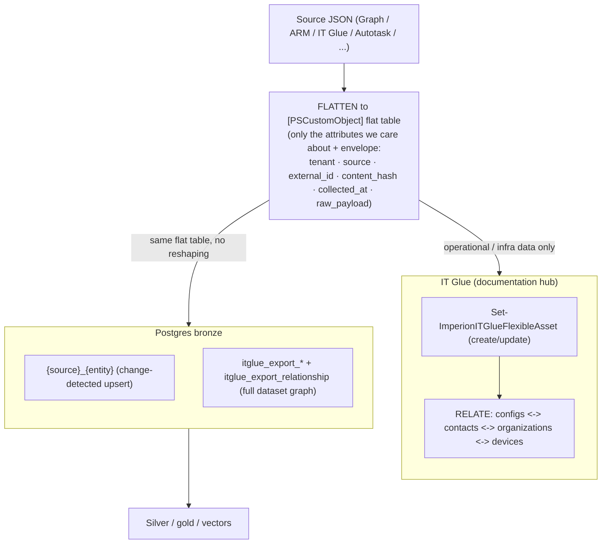

# IT Glue hub (guide)

**IT Glue is a first-class documentation + relationship hub, not just a source** (ADR-0006).
The flattening step produces a flat `[PSCustomObject]` table that serves two consumers from one
shape — it is **written into IT Glue** (and related to other IT Glue objects) *and* the
**identical table imports straight into Postgres bronze**, no reshaping.

> **Deeper references:** the open-relationship import model (per-type tables + one polymorphic
> edge table) is [`database/itglue-to-postgres-relationships.md`](database/itglue-to-postgres-relationships.md);
> the per-source auth/fields doc is [`integrations/itglue.md`](integrations/itglue.md). This page
> is the onboarding narrative. ADR: **ADR-0006**.

## The two-consumer pattern

## Which sources take the IT Glue path?

- **Operational / infrastructure data** (devices, configurations, the 365/Azure picture,
  service principals) flows through IT Glue — keeping the MSP's operational documentation
  current and related is the point.
- **Pure CRM / finance / logistics data** (Apollo, KQM proposals, DocuSign contracts, QBO,
  Amazon/CDW, myITprocess strategic recommendations) flattens **straight to Postgres** — the IT
  Glue step is skipped where it adds nothing (ADR-0006 §2).

## Reading IT Glue (collectors → bronze)

| Cmdlet | Bronze target |
| --- | --- |
| `Get-ImperionITGlueOrganization` → `Set-ImperionITGlueOrganizationToBronze` | `itglue_companies` (ADR-0039 shape) |
| `Get-ImperionITGlueContact` → `Set-ImperionITGlueContactToBronze` | `itglue_contacts` (ADR-0039 shape) |
| `Get-ImperionITGlueConfiguration` → `Set-ImperionITGlueConfigurationToBronze` | `itglue_devices` (ADR-0039 shape) |
| `Invoke-ImperionITGlueExport` → `Invoke-ImperionITGlueExportToBronze` | the **full dataset graph** → `itglue_export_<type>` + `itglue_export_relationship` (multi-table router; unknown entity fails loudly) |

All read through the shared connect layer `Invoke-ImperionITGlueRequest` (JSON:API paging).
Scheduled daily (the export 12h–daily). See
[`operations/scheduled-task-registry.md`](operations/scheduled-task-registry.md).

## The open-relationship import model

IT Glue relationships are open/typed (JSON:API `relationships`), so a fixed
column-per-relation schema doesn't fit. We use **per-type attribute tables + one polymorphic
many-to-many edge table** (`itglue_export_relationship`), so any new relation type is absorbed
with **no schema change**. The loader does delete-then-insert of a record's outbound edges so
edges stay convergent on re-run, and watermarks `updated-at` per type for incrementals. Full
DDL + load algorithm: [`database/itglue-to-postgres-relationships.md`](database/itglue-to-postgres-relationships.md).

## Writing to IT Glue is a gated write path

`Set-ImperionITGlueFlexibleAsset` is the documentation-hub **write** cmdlet (resolve
flexible-asset-type by name, find-or-create by a key trait, then create/update). Per the system
posture, IT Glue documentation writes stay **scoped and gated** — they document the MSP's own
operational picture, never silently push beyond agreed scope. A net-new IT Glue write surface is
surfaced for human approval (system `CLAUDE.md`).

## Excluded

`passwords` and other secret-bearing IT Glue fields are **not** exported (ADR-0006). **Never
commit secrets.**
