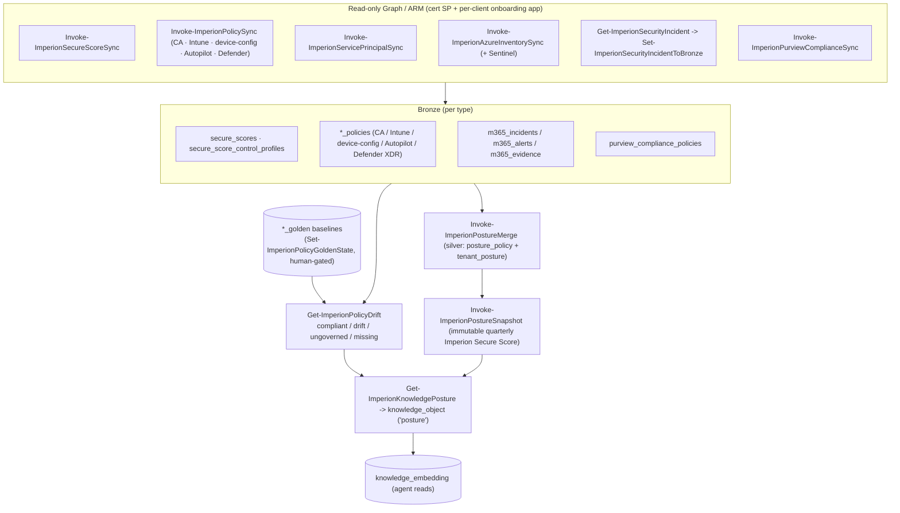

# Security-posture bronze (guide)

Beyond CRM/support/finance, the module ingests the **Microsoft security estate** read-only and
maintains an approved **golden state** per policy type so it can flag **drift**. This is the
"are these tenants configured the way we agreed?" surface, fed to the agent as gold posture
objects.

> **Deeper references:** the golden-state / drift mechanics are
> [`database/golden-states-and-drift.md`](database/golden-states-and-drift.md); per-source
> auth/fields are in [`integrations/`](integrations/) (`secure-score.md`,
> `security-posture-policies.md`, `security-incidents.md`, `purview-compliance.md`). ADRs:
> **ADR-0008** (golden states + drift) · **ADR-0010** (silver merge) · **ADR-0011** (quarterly
> snapshots) · **ADR-0019** (incidents + Purview).

## The posture pipeline

## Policy types & golden states (ADR-0008)

Each policy type keeps an approved **golden state** (the baseline we promote a known-good policy
to). `Get-ImperionPolicyDrift` compares live bronze vs golden and verdicts each:
**compliant / drift / ungoverned / missing**.

| Area | What | Observed table(s) | Golden state |
| --- | --- | --- | --- |
| **Secure Score** | overall snapshots + control attributes | `secure_scores`, `secure_score_control_profiles` | — |
| **Conditional Access** | CA policies | `entra_conditional_access_policies` | `conditional_access_policies_golden` |
| **Intune security** | settings-catalog / endpoint security | `intune_security_policies` | `intune_security_policies_golden` |
| **Device configuration** | device config profiles | `device_configuration_policies` | `device_configuration_policies_golden` |
| **Autopilot** | deployment profiles | `autopilot_policies` | `autopilot_policies_golden` |
| **Defender XDR** | endpoint-security (AV/EDR/FW/ASR) | `defender_xdr_security_policies` | `defender_xdr_security_policies_golden` |

`Set-ImperionPolicyGoldenState` promotes a current policy to baseline — **human-gated**.

## Silver merge & quarterly snapshots

- **`Invoke-ImperionPostureMerge`** (daily 03:20, after Secure Score + PolicySync) classifies
  the night's fresh bronze into silver `posture_policy` and rolls it up to `tenant_posture`,
  including unmapped tenants (ADR-0010).
- **`Invoke-ImperionPostureSnapshot`** (daily 03:40, self-gates to calendar quarters) writes an
  **immutable** `posture_snapshot` (+ pillar) per mapped account — the **Imperion Secure Score**,
  Score Model v1 parity-pinned to the front-end `imperion-score.ts` (ADR-0011). On-demand / QBR
  triggers bypass the quarter gate.

## Incidents, Purview, and retention (ADR-0019)

- **Security incidents** (`Get-ImperionSecurityIncident` → `Set-ImperionSecurityIncidentToBronze`,
  hourly) — the incident → alerts → evidence fidelity payload → `m365_incidents` / `m365_alerts`
  / `m365_evidence`, carrying `autotask_ticket_ref` **raw** (format **confirm-before-live** before
  the MS↔Autotask silver stitch). Read-only onboarding-app Graph. **DORMANT until creds** (#102).
- **Purview compliance** (`Invoke-ImperionPurviewComplianceSync`, daily) — compliance **posture
  only, NO alerts** → `purview_compliance_policies` + `_golden` drift via the existing engine.
  Held out of the posture silver merge until the FE widens the `policy_family` CHECK.
- **180-day retention sweep** (`Invoke-ImperionSecurityRetentionSweep`, daily) — prunes
  `m365_incidents` / `m365_alerts` / `m365_evidence` **ONLY** (Autotask is the durable system of
  record). Leaf-first, idempotent, `-WhatIf`-aware, count-only logging; first live run is gated.

## Other security sources

Dark Web ID (credential compromises), Telivy (assessment reports), EasyDMARC (domain DMARC/SPF/
DKIM/BIMI posture), and the DNS golden/drift planes (ADR-0063) all land here too — see the
[collector inventory](collector-inventory.md).

## Posture data → gold

`Get-ImperionKnowledgePosture` composes **one `knowledge_object` per tenant** — latest Secure
Score + per-type policy drift counts and **named gaps** via `Get-ImperionPolicyDrift` — which the
vectorizer embeds so the agent can reason over each tenant's security stance. No per-policy raw
detail or PII enters gold.

## Posture & secrets

All posture reads are **read-only** (broad `Reader` on Azure + the read-only onboarding app on
365). Credential compromise detail (Dark Web ID) is carried as **facts**, never plaintext
credentials. **Never commit secrets.** Provenance and lawful-basis stamping apply per the system
posture (referenced, not restated, from `unified-security-standard.md`).
