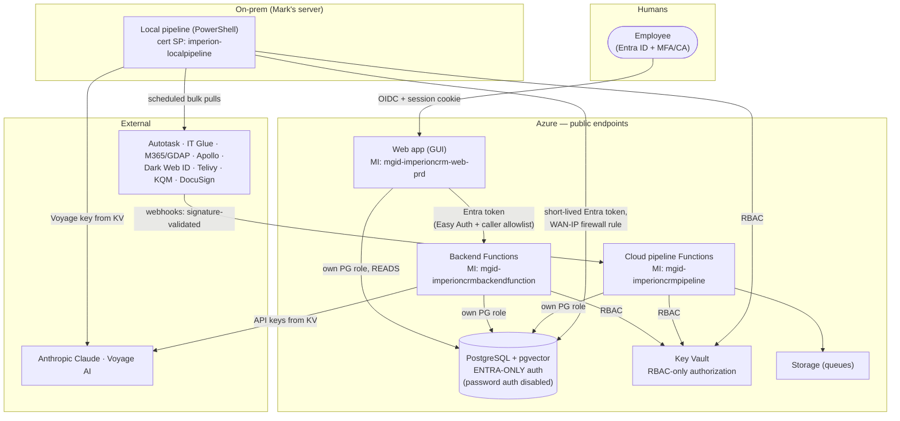

# ImperionCRM unified security standard

> **One standard, four repos.** This document is mirrored into `ImperionCRM` (front end),
> `ImperionCRM_Backend`, `ImperionCRM_Pipeline`, and `ImperionCRM_LocalPipelineEnrichment`
> under `docs/security/unified-security-standard.md`. The core sections are identical
> everywhere; only §6 ("this repo's identity") differs per repo. When the standard
> changes, change it in **all four** repos in the same working session.
>
> Decision provenance: backend ADR-0035 (public endpoints + Entra-only identity),
> backend ADR-0034 + front-end ADR-0041 (AI stack), local-pipeline ADR-0002/0003
> (certificate + short-lived DB tokens), front-end ADR-0014 (consent ledger).

---

## 1. The model in one picture

**There is no private network. Identity is the perimeter.** Private networking (VNet
integration, private endpoints, private DNS) was deliberately omitted for cost
(2026-06-09); it is a future *additional* tier, never a substitute for the rules below.

## 2. Identity rules (non-negotiable)

1. **One workload, one identity.** Every web app, function app, and pipeline runs as its
   **own** Entra principal — a user-assigned managed identity in Azure, a
   certificate-backed service principal on-prem. Identities are never shared across
   workloads, and no workload uses a human's identity.
2. **No stored passwords, anywhere.** PostgreSQL is **Entra-only** (password
   authentication disabled). Every connection mints a short-lived Entra token. There is
   no `DATABASE_URL` with a password in any deployed environment.
3. **Least privilege, per principal.**
   - Each identity gets its **own Postgres role** with **table-scoped GRANTs** — only the
     tables it touches, only the verbs it needs (the on-prem role has no DELETE except
     the one scoped vector-pruning grant, migration 0045).
   - Key Vault is **RBAC-only**: *Secrets User* (read) by default; *write* roles only for
     the backend, which owns credential storage. Vault enumeration is never required —
     readers fetch specific named secrets.
   - Azure control-plane access for pipelines is **Reader**; any write is an explicit,
     human-approved grant.
4. **Humans go through Entra.** MFA / Conditional Access / passkeys per tenant policy.
   App RBAC maps from Entra groups/app roles (front-end ADR-0030). Break-glass exists,
   is disabled by default, and is audited (front-end ADR-0008).

## 3. Network rules

1. **Public endpoints are acceptable; anonymous access never is.** Every inbound path is
   one of: Entra-authenticated (Easy Auth + caller allowlist for app-to-app),
   session-authenticated (the web app's OIDC), or **signature-validated** (webhooks:
   HMAC / validation tokens + client state).
2. **Fixed-IP firewall rules only where a fixed IP exists** (the on-prem server's WAN IP
   on Postgres). Never build the perimeter on Azure outbound IPs — they change on scale
   events.
3. **TLS everywhere**, verified (no `rejectUnauthorized: false`, no `--insecure`).
4. **The future tier:** when revenue justifies private networking, add VNet integration +
   private endpoints *on top of* these rules. Nothing in this standard relaxes when that
   happens.

## 4. Secrets & data rules

1. **Key Vault is the only secret store.** Source API keys, OAuth tokens, AI provider
   keys: all in the vault. The database stores only `keyvault_secret_ref` pointers;
   config stores only secret *names*. Nothing secret in the repo, app settings values,
   or logs.
2. **On-prem unattended secrets** follow the certificate chain (local-pipeline
   ADR-0002): a non-exportable machine certificate CMS-decrypts the SecretStore vault
   password; the same certificate is the Entra app's credential. No plaintext secret at
   rest on the box.
3. **Consent is a hard gate.** Every outbound send / ad use reads `current_consent` and
   refuses unless opted in — at draft time *and* re-asserted at execution (backend
   ADR-0033). No code path routes around it.
4. **Provenance + lawful basis on every enriched fact** (`contact_enrichment`); bronze
   raw payloads are PII-adjacent and access-controlled; agents reason over the gold
   layer, not raw bronze.
5. **Audit everything that acts.** Agent turns (inputs, tool calls, model, tokens, cost,
   acting user), credential writes, sends, and DB migrations land in `audit_log` /
   structured logs. Approval-gated actions (sends, consent, permissions, billing) are
   proposed by agents and **executed only after human approval**.
6. **AI stack (settled):** Claude for generation, Voyage `voyage-3-large` @ 1024 for
   embeddings (backend ADR-0034 / front-end ADR-0041). Both keys live in Key Vault.
   Claude consumes retrieved gold-layer *text*; embeddings are pinned to one
   (model, dimension, chunking) contract so vector spaces never mix.

## 5. Engineering rules

- **Schema is single-sourced** in the front-end repo (`db/migrations`, ADR-0017); every
  other repo is a consumer. Migrations run with an Entra token, never a password.
- **Webhook receivers fail closed** (signature mismatch → reject); **GDAP-gated ingestion
  fails closed** when a relationship is not active.
- **Idempotency by content hash** everywhere data lands (bronze upserts, embeddings) —
  replays are safe and re-billing is impossible.
- **CI/CD deploys via OIDC federated credentials** — no publish-profile or deployment
  secrets in GitHub.
- **A feature is not done without its docs** — including the security sections of the
  relevant ADR (threat, options, impact). See the documentation standard in
  `docs/README.md`.

## 6. This repo's identity (ImperionCRM_LocalPipelineEnrichment — on-prem)

| Property | Value |
| --- | --- |
| Workload | Windows Scheduled Tasks on Mark's home server running the `ImperionPipeline` module (bulk ingestion + IT Glue hub + ALL vectorization) |
| Identity | Certificate-backed Entra service principal (cert in `Cert:\LocalMachine\My`, non-exportable, private key ACL'd to the task identity — ADR-0002) |
| Postgres role | `imperion-localpipeline` — short-lived Entra token per run (ADR-0003); table-scoped GRANTs (migrations 0044/0045): SELECT/INSERT/UPDATE on its tables, DELETE **only** on `knowledge_embedding` (vector lifecycle) |
| Key Vault | `kv-imperioncrm-prd` — *Secrets User* (reads specific named secrets; never enumerates) |
| Local secrets | PowerShell SecretStore, CMS-unlocked by the certificate (ADR-0002): source API keys + the Voyage key (`embedding-provider-key`) |
| Network | **No inbound surface at all** — outbound HTTPS only (sources, Graph/ARM, Voyage, Postgres). Postgres firewall allowlists this site's WAN IP |
| Azure / 365 plane | Read-only by default: `Reader` on Azure, read-only GDAP into client tenants (fail closed); writes only to Storage / Postgres / Key Vault |
| Writes allowed | Per-source bronze tables · `knowledge_object` / `knowledge_embedding` (sole vector producer) · golden-state tables (human-gated promote) · scoped IT Glue documentation (human-gated) |
| Never | Receive internet traffic · run schema migrations · send outbound comms · widen a grant without human approval · hold a plaintext secret on disk |
