# Vectorization → gold (guide)

How silver becomes the **gold knowledge layer** and then **vectors** the backend agent
retrieves. This repo owns **all** embedding (it moved off the website precisely because it is
the heaviest, burstiest, most cost-sensitive stage). **The stage is LIVE in prod** — ~205
`knowledge_object` rows are composed and embedded nightly.

> **This is memory consolidation.** In Imperion OS (data-as-kernel + second-brain-as-OS) this
> nightly pass is the **hippocampus writing long-term memory**: facts (silver) are *composed
> into knowledge* (gold) and *encoded for recall* (vectors). The pinned Voyage contract is the
> **fixed encoding of long-term memory**, and the citation views below are **recall with
> attribution** — the agent can cite its source rather than hallucinate. The full
> second-brain superiority argument is the front-end canonical doc
> [`data-design-for-agents.md`](https://github.com/markdconnelly/ImperionCRM/blob/main/docs/architecture/data-design-for-agents.md)
> (linked, not duplicated).

> **Deeper reference:** the as-built lifecycle, target schema, idempotency layers, and
> citation views are in [`database/vector-lifecycle.md`](database/vector-lifecycle.md). This
> page is the onboarding narrative. ADRs: **ADR-0009** (settled embedding stack, this repo) ·
> front-end **ADR-0041** (the vector contract) · backend **ADR-0034** (the agent's query
> embeddings) · front-end **ADR-0068** (conversation_segment as the embedding unit).

## The pipeline

```mermaid
flowchart LR
    subgraph SILVER["Silver + bronze inputs"]
      direction TB
      A["account · contact · contract · ticket · device"]
      B["credential_exposure · assessment_artifact · proposal · posture"]
      C["social interactions (FB/IG) · conversation_segment (ACS/Teams/Plaud)"]
    end

    SILVER --> COMPOSE
    subgraph COMPOSE["Compose (Get-ImperionKnowledge* over Invoke-ImperionKnowledgeCompose)"]
      direction TB
      K["one knowledge_object per entity:<br/>tenant_id · entity_type · entity_ref ·<br/>title · body · summary · source · content_hash · metadata"]
    end

    COMPOSE --> KO[("knowledge_object<br/>Set-ImperionKnowledgeObject (upsert, content_hash gated)")]
    KO --> CHUNK["Split-ImperionTextChunk (v1: 6000 chars / 500 overlap)"]
    CHUNK -->|changed objects only| VOYAGE["Get-ImperionVoyageEmbedding<br/>voyage-3-large @ 1024 (refuses other dims)"]
    VOYAGE --> KE[("knowledge_embedding (pgvector 1024)<br/>Invoke-ImperionVectorizeKnowledge")]
    KE --> AGENT["Backend orchestrator (embeds only queries, same contract)"]
    KE -.citation.-> CITE["conversation_segment_citation view<br/>(retrieved vector -> source conversation + turn)"]
```

Entry point: **`Invoke-ImperionKnowledgeSync [-Vectorize]`**, run by the
`Imperion-KnowledgeVectorize` scheduled task **nightly at 04:30**, after the ingest tasks have
refreshed the silver/gold inputs.

## What gets composed (coverage)

`Get-ImperionKnowledge*` composers, each a thin adapter over the shared
`Invoke-ImperionKnowledgeCompose` spine (#106) which owns the tenant default, connection
lifecycle, related-row caches, the row emit + `content_hash` over title+body, and the metric
log. Entity types: **account · contact · contract · ticket · device · exposure · assessment ·
proposal · posture · social · conversation_segment · memory · semantic_concept**. A new
DB-sourced entity is a SQL query + a `-Compose` scriptblock — the row shape and idempotency
contract live in one place.

> **`semantic_concept` is filesystem-sourced, not DB-sourced** (LP #176; front-end ADR-0086
> bundle / ADR-0041 contract). `Get-ImperionKnowledgeSemanticConcept` reads the front-end OKF
> semantic-layer bundle — one curated markdown concept file per silver entity (what it *means*,
> its source-of-record/authority, its joins) — and emits ONE `entity_type='semantic_concept'`
> object per file (`entity_ref = <concept>`, `title`/`summary` from frontmatter, `body` = the
> prose with frontmatter stripped, the frontmatter facets + `source_doc` back-reference in
> `metadata`). The bundle is the front end's canon (CLAUDE.md §11) — this repo never forks it;
> `Resolve-ImperionOkfBundle` resolves a local checkout or shallow-clones it read-only. A
> human-edited semantic corpus is far better agent grounding than a raw schema dump. The bundle
> is **PII-free by the ADR-0086 conformance rules** (definitions, not row data), so only curated
> docs are embedded — never row-level prod data. Entry point: **`Invoke-ImperionSemanticConceptSync
> [-Vectorize]`** (suggested task `Imperion-SemanticConceptVectorize`; wiring the schedule is
> Mark-gated, CLAUDE.md §10). It rides the normal chunk→Voyage→pgvector stage scoped to
> `entity_type='semantic_concept'`.

> **PII / safety boundaries (enforced in the composers):** `exposure` carries
> `credential_exposure` **facts only** — no raw breach payloads, no plaintext credentials ever
> reach gold. `posture` is one object per tenant (Secure Score + drift counts + named gaps),
> not per-policy detail. `conversation_segment` excludes purged conversations both in the query
> and the citation view. `memory` (deliberate-capture memory threads, LP #300 / front-end
> ADR-0113/0115/0116) rolls each conversation's verbatim `memory_drawer` rows into ONE
> `entity_type='memory'` object (`entity_ref = conversation_id`), with `wing`/`room`/`agent_slug`
> in `metadata` — the **exact facet keys the backend recall path filters on** (`recallMemory`'s
> `metadata @>` containment). Drawer bodies are PII-bearing verbatim memory; they flow
> bronze→gold→Voyage like transcript segments, embedded **in place** (never copied off-box). The
> verbatim is the drill-down target (ADR-0113: reason over the gold summary, recall the verbatim).
> _(This is the gold path; the original #300 sketch of an inline `memory_drawer.embedding` column
> was superseded by ADR-0114 §9 — there is no inline personal vector.)_

## The pinned vector contract (ADR-0009 / front-end ADR-0041)

- **Provider:** Voyage AI, called **directly** — no provider router (the system retired
  provider-agnosticism). Anthropic's recommended embeddings provider for Claude RAG.
- **Model + dimension:** `voyage-3-large` at **dimension 1024**, system-wide. Every row stores
  `embedding_model='voyage-3-large'`, `dimension=1024`, `chunking_version`.
- **One source of truth:** the constants (model, dimension, chunking, batch size, cost rate)
  live in `Get-ImperionVectorContract`. `Get-ImperionVoyageEmbedding` **refuses any response
  vector that is not exactly 1024** — vector spaces can never silently mix.
- **The backend embeds only queries** against the same contract (backend ADR-0034); this repo
  embeds the corpus (`input_type='document'`).

## Idempotency & cost (two layers)

1. **Object layer:** unchanged `knowledge_object.content_hash` → the row is not rewritten.
2. **Chunk layer:** unchanged **chunk-hash set** for the pinned `(embedding_model,
   chunking_version)` → **no re-embed, no re-billing**.

Re-runs converge. Every run emits a `Metric` log line: objects scanned/unchanged/embedded,
chunks, billed tokens, estimated USD (~$0.18/M tokens input-only), provider, model, dimension,
chunking version, duration.

## Re-embedding (versioned, never in-place)

A model or chunking change is a **versioned re-embed**: the vectorizer only ever replaces rows
matching its own `(embedding_model, chunking_version)`; other versions coexist until verified,
then pruned (the SP's scoped `DELETE` on `knowledge_embedding`). A **dimension** change needs a
new `vector(N)` column — a front-end migration.

## Citation views — recall with attribution (conversation segments, front-end ADR-0068)

Recall in a second brain must be *verifiable* — memory the agent can cite, not invent.
A retrieved `knowledge_embedding` whose object is `entity_type='conversation_segment'` resolves
to its source conversation + diarized turn through the **`conversation_segment_citation`** view
(DDL source-of-record in [`../sql/`](../sql/), pending front-end migration), so the backend can
render an attributed citation (channel / account / speaker / offsets / text). See
[`database/vector-lifecycle.md`](database/vector-lifecycle.md) for the join detail.

## API key resolution (front-end ADR-0129 §8, supersedes ADR-0009)

Explicit `-ApiKey` wins; else the Voyage key — the PLATFORM-scope AI credential — is read from
**Key Vault `conn-platform-voyage`** by the cert SP (`Key Vault Secrets User`). The mis-named
starter secret (`Voyage-Embedding-API-Key` / SecretStore `embedding-provider-key`) is retired
(folds #389); there is no SecretStore mirror. Key Vault, via the `connection` registry's
platform scope, is the single source of truth — the same link the backend resolves. **Never
commit the key** (system posture).
